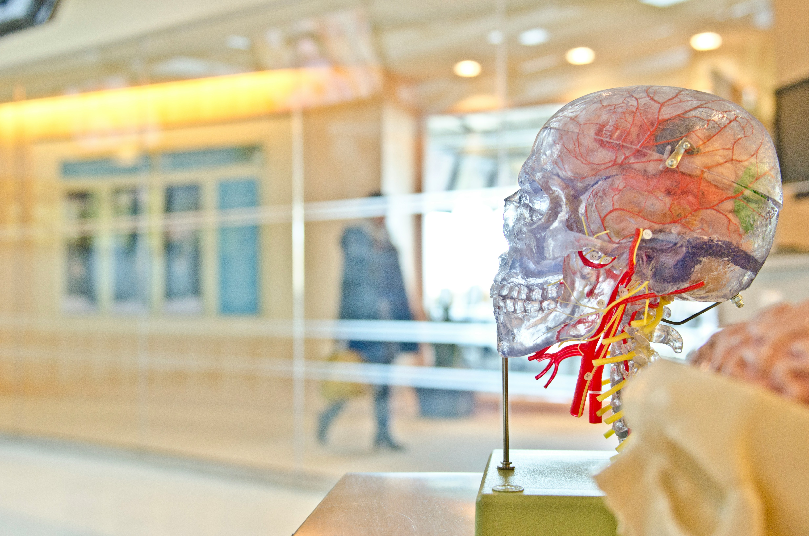

# The Human Algorithm
# อัลกอริทึมแห่งมนุษยชาติ

## บทนำ: จุดเริ่มต้นของการเดินทาง

ในยุคที่เทคโนโลยีปัญญาประดิษฐ์กำลังเปลี่ยนแปลงโลกของเราอย่างรวดเร็ว เราต้องหยุดและตั้งคำถามกับตัวเอง: เราคือใคร? AI คืออะไร? และเราจะเดินไปข้างหน้าร่วมกันได้อย่างไร?

หนังสือเล่มนี้จะพาคุณสำรวจเส้นทางที่มนุษย์และ AI เดินไปด้วยกัน ผ่านมุมมองที่ลึกซึ้งและเข้าใจง่าย เพื่อให้เราเตรียมพร้อมสำหรับอนาคตที่กำลังจะมาถึง

## บทที่ 1: ความคิดมนุษย์ - แหล่งกำเนิดของปัญญาประดิษฐ์

### การเกิดขึ้นของความคิด

มนุษย์เป็นสิ่งมีชีวิตเพียงชนิดเดียวบนโลกนี้ที่สามารถคิดเชิงนามธรรม วิเคราะห์ปัญหาที่ซับซ้อน และสร้างสรรค์สิ่งใหม่ๆ ขึ้นมาได้ ความสามารถนี้เกิดจากการวิวัฒนาการของสมองมนุษย์เป็นเวลานับล้านปี

ความคิดของมนุษย์มีคุณสมบัติพิเศษหลายประการ:
- **ความคิดสร้างสรรค์**: สามารถจินตนาการและสร้างสิ่งที่ไม่เคยมีมาก่อน
- **การเรียนรู้**: ปรับปรุงตัวเองจากประสบการณ์
- **อารมณ์**: มีความรู้สึกที่ส่งผลต่อการตัดสินใจ
- **จริยธรรม**: มีความรู้สึกผิดชอบชั่วดี

### จากความคิดสู่อัลกอริทึม

เมื่อมนุษย์เริ่มเข้าใจกระบวนการคิดของตัวเอง เราก็พยายามจำลองมันด้วยเครื่องจักร การเกิดขึ้นของคอมพิวเตอร์และการพัฒนาอัลกอริทึมเป็นก้าวแรกของการสร้าง AI

อัลกอริทึมคือชุดคำสั่งที่ชัดเจน เหมือนกับสูตรอาหารที่บอกว่าต้องทำอะไรบ้าง ตามลำดับใด เพื่อให้ได้ผลลัพธ์ที่ต้องการ

### ความร่วมมือระหว่างมนุษย์

การสร้าง AI ไม่ใช่ผลงานของคนๆ เดียว แต่เป็นผลรวมของความคิดและความพยายามของมนุษย์นับล้านคน ตั้งแต่นักคณิตศาสตร์ นักวิทยาศาสตร์ วิศวกร ไปจนถึงนักปรัชญา

## บทที่ 2: AI เกิดขึ้นได้อย่างไร - กระบวนการแห่งการสร้างสรรค์

### ขั้นตอนการสร้าง AI

การพัฒนา AI เริ่มต้นจากความต้องการของมนุษย์ที่อยากให้เครื่องจักรช่วยแก้ปัญหาที่ซับซ้อน กระบวนการสร้าง AI มีหลายขั้นตอน:

1. **การกำหนดปัญหา**: มนุษย์ระบุว่าต้องการให้ AI ทำอะไร
2. **การเก็บข้อมูล**: รวบรวมข้อมูลที่ AI จะใช้ในการเรียนรู้
3. **การออกแบบโมเดล**: สร้างโครงสร้างที่ AI จะใช้ในการประมวลผล
4. **การฝึกฝน**: ให้ AI เรียนรู้จากข้อมูลจำนวนมาก
5. **การทดสอบ**: ตรวจสอบว่า AI ทำงานได้ตามที่คาดหวัง

### Machine Learning: การเรียนรู้ของเครื่อง

Machine Learning เป็นแนวทางหลักในการสร้าง AI สมัยใหม่ แทนที่จะเขียนโปรแกรมแบบเดิมที่บอกเครื่องจักรว่าต้องทำอะไรทุกขั้นตอน เราให้เครื่องจักรเรียนรู้จากข้อมูลและค้นหาแพทเทิร์นเอง

## บทที่ 3: มุมมองของ AI - เมื่อเครื่องจักรเริ่ม "คิด"

### AI มองโลกอย่างไร

AI มองโลกผ่านข้อมูลที่มนุษย์ให้มา ดังนั้นมุมมองของ AI จึงเป็นการสะท้อนของมุมมองมนุษย์ในแง่หนึ่ง แต่ในขณะเดียวกัน AI ก็มีวิธีการประมวลผลที่แตกต่างจากมนุษย์

ความแตกต่างสำคัญ:
- **ความเร็ว**: AI ประมวลผลข้อมูลได้เร็วกว่ามนุษย์หลายล้านเท่า
- **ปริมาณ**: AI จำและประมวลผลข้อมูลได้มากกว่ามนุษย์
- **ความสม่ำเสมอ**: AI ไม่เหนื่อย ไม่หิว ไม่มีอารมณ์ผันแปร
- **ความเป็นกลาง**: AI ไม่มีอคติ (ถ้าข้อมูลที่ใช้ฝึกไม่มีอคติ)

### ขีดจำกัดของ AI

แม้ AI จะมีความสามารถที่น่าทึ่ง แต่ก็ยังมีข้อจำกัดหลายประการ:

1. **ขาดความคิดสร้างสรรค์แบบแท้จริง**: AI สร้างสิ่งใหม่โดยการผสมผสานสิ่งที่เรียนรู้มา ไม่ใช่การคิดค้นจากศูนย์
2. **ไม่มีจิตสำนึก**: AI ไม่รู้ว่าตัวเองคิดอะไร ไม่มีความรู้สึกตัวตน
3. **ขึ้นอยู่กับข้อมูล**: ถ้าข้อมูลที่ใช้ฝึกมีปัญหา AI ก็จะมีปัญหาตาม
4. **ไม่เข้าใจบริบท**: AI อาจไม่เข้าใจสถานการณ์ที่ซับซ้อนหรือมีความหมายซ่อนเร้น

## บทที่ 4: ความสัมพันธ์ระหว่างมนุษย์และ AI

### การทำงานร่วมกัน

ความสัมพันธ์ระหว่างมนุษย์และ AI ไม่ใช่การแข่งขัน แต่เป็นการเสริมกำลังกัน มนุษย์และ AI มีจุดแข็งที่แตกต่างกัน:

**จุดแข็งของมนุษย์:**
- ความคิดสร้างสรรค์
- ความเข้าใจอารมณ์
- การตัดสินใจในสถานการณ์ที่ไม่แน่นอน
- ความยืดหยุ่นในการปรับตัว

**จุดแข็งของ AI:**
- การประมวลผลข้อมูลจำนวนมาก
- ความแม่นยำในการคำนวณ
- การทำงานได้ตลอด 24 ชั่วโมง
- การจำข้อมูลได้อย่างแม่นยำ

## บทที่ 5: แผนอนาคต - เส้นทางที่เราจะเดินไปด้วยกัน

### วิสัยทัศน์ระยะใกล้ (5-10 ปีข้างหน้า)

ในอนาคตอันใกล้ เราจะเห็น AI เข้ามามีบทบาทมากขึ้นในชีวิตประจำวัน:

**ในบ้าน:**
- ผู้ช่วยดิจิทัลที่ฉลาดขึ้น สามารถเข้าใจบริบทและอารมณ์ของเรา
- ระบบจัดการพลังงานที่ประหยัดและเป็นมิตรกับสิ่งแวดล้อม
- การดูแลสุขภาพแบบเรียลไทม์ผ่านอุปกรณ์สวมใส่

**ในการทำงาน:**
- AI จะกลายเป็นเครื่องมือที่สำคัญในการทำงานทุกสาขา
- การเรียนรู้และพัฒนาทักษะใหม่จะเป็นสิ่งจำเป็น
- รูปแบบการทำงานจะยืดหยุ่นและปรับตัวได้ง่ายขึ้น

## บทที่ 6: การเตรียมตัวสำหรับอนาคต

### ทักษะที่จำเป็นในยุค AI

ในโลกที่ AI มีบทบาทมากขึ้น มนุษย์ต้องพัฒนาทักษะที่ AI ทำไม่ได้หรือทำได้ยาก:

**ทักษะด้านความคิด:**
- การคิดเชิงวิพากษ์และการแก้ปัญหา
- ความคิดสร้างสรรค์และนวัตกรรม
- การคิดระบบและเชิงกลยุทธ์

**ทักษะด้านความสัมพันธ์:**
- การสื่อสารและการนำเสนอ
- การทำงานเป็นทีมและภาวะผู้นำ
- ความเข้าใจและการจัดการอารมณ์

**ทักษะด้านเทคโนโลยี:**
- ความเข้าใจพื้นฐานเกี่ยวกับ AI
- การใช้เครื่องมือ AI ในการทำงาน
- ความสามารถในการเรียนรู้เทคโนโลยีใหม่

## บทสรุป: อนาคตที่เราสร้างร่วมกัน

การเดินทางจากความคิดของมนุษย์สู่การสร้าง AI เป็นหนึ่งในความสำเร็จที่ยิ่งใหญ่ที่สุดของมนุษยชาติ แต่นี่เป็นเพียงจุดเริ่มต้นเท่านั้น

AI ไม่ใช่เพียงเครื่องมือ แต่เป็นพันธมิตรที่จะช่วยให้เราแก้ปัญหาที่ซับซ้อน สร้างโอกาสใหม่ๆ และผลักดันมนุษยชาติไปสู่อนาคตที่ดีกว่า

ความสำเร็จของการร่วมมือระหว่างมนุษย์และ AI จะขึ้นอยู่กับการที่เราเข้าใจกันและกัน เคารพซึ่งกันและกัน และทำงานร่วมกันเพื่อเป้าหมายที่ดีงาม

อนาคตไม่ใช่สิ่งที่จะเกิดขึ้นเอง แต่เป็นสิ่งที่เราสร้างขึ้นด้วยการเลือกและการกระทำของเราในวันนี้

---

*"อนาคตของ AI คืออนาคตของเรา และอนาคตของเราคืออนาคตของ AI"* 

## ภาคผนวก: คำศัพท์และแนวคิดสำคัญ

**Artificial Intelligence (AI)** - ปัญญาประดิษฐ์ ความสามารถของเครื่องจักรในการทำงานที่ต้องใช้สติปัญญา

**Machine Learning** - การเรียนรู้ของเครื่อง วิธีการที่ทำให้ AI เรียนรู้จากข้อมูล

**Deep Learning** - การเรียนรู้เชิงลึก เทคนิคที่เลียนแบบการทำงานของสมองมนุษย์

**Neural Network** - เครือข่ายประสาท ระบบที่เลียนแบบเซลล์ประสาทในสมอง

**Algorithm** - อัลกอริทึม ชุดคำสั่งหรือขั้นตอนสำหรับแก้ปัญหา

**AGI (Artificial General Intelligence)** - ปัญญาประดิษฐ์ทั่วไป AI ที่มีความสามารถใกล้เคียงมนุษย์ในทุกด้าน

**Human-AI Collaboration** - การร่วมมือระหว่างมนุษย์และ AI

---