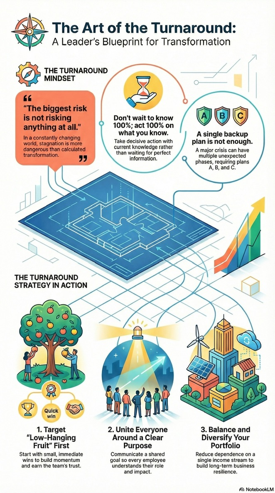

I recently watched an incredible interview with CEO Suphajee Suthumpun on the Thai Chamber Channel. Her career is a masterclass in transformation, spanning three distinct industries.

Here are the key lessons I distilled from her experiences at IBM, Thaicom, and Dusit Thani:

### 1. IBM: The Pivot (The 5 Steps Framework)
**The Challenge:** Transforming a 100-year-old hardware giant to survive the digital age. 

**The Lesson:** To avoid becoming a "dinosaur," she implemented a 5-step framework:
* **Clarity:** Communicate the "why." Everyone must understand their impact.
* **Standard:** Define clear roles and KPIs.
* **Flexibility:** Standards provide the rails, but flexibility allows the train to navigate obstacles.
* **Ownership:** Involve everyone in shaping the DNA.
* **Recognition:** Celebrate champions and manage out those who don't align.

### 2. Thaicom: The Turnaround (The Quick Win Plan)
**The Challenge:** Rescuing a company from financial loss and political turmoil. 

**The Lesson:**
* **Set the Vision:** Make it a company employees and the nation can be proud of.
* **Dive into the Balance Sheet:** Scrutinize the P&L immediately.
* **Cash is King:** Aggressively collect outstanding receivables to boost the bottom line.

### 3. Dusit Thani: The Expansion (The 3-Pillar Strategy)
**The Challenge:** Complacency. "A business that is not growing is effectively moving backward." 

**The Lesson:**
* **Balance:** Reduce dependency on single income streams.
* **Expand:** Aggressively grow the global footprint.
* **Diversify:** Invest in adjacent, synergistic businesses beyond hotels.

### The Transformational Leader’s Mindset: 
* **Think Big, Act Small:** Have an ambitious vision, but execute with manageable steps. 
* **Become "T-Shaped":** Deep expertise in one area, broad connection across others. 
* **Embrace Balance:** Know when to drive hard and when to empower others.

> "You don’t need to know 100% to start, but you must do 100% of what you know."

### Reference
* [The Biggest Risk Is Taking No Risk At All](https://youtu.be/OcmKfsBmhfc?si=L12QXocl872NGwE4)

What is your favorite strategy for managing business transformation?