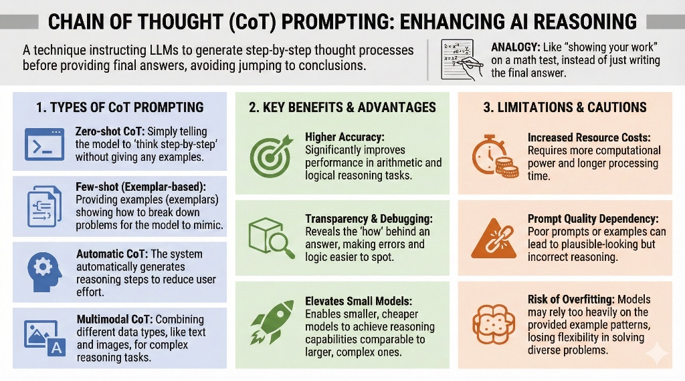

**Chain of Thought (CoT)** is a technique in Prompt Engineering designed to **enhance the reasoning capabilities** of Large Language Models (LLMs), particularly for complex tasks. Instead of asking the model to provide an answer immediately, this technique instructs the model to display its thinking process step-by-step before reaching a final conclusion. This approach helps reduce errors caused by the model attempting to answer instantly without planning the problem-solving process.

### Types of CoT Prompting
Key usage patterns identified in resources include:
*   **Zero-shot CoT:** Instructing the model to "think step-by-step" (e.g., using the command "explain your answer step-by-step") without the user needing to provide examples of thinking beforehand.
*   **Few-shot (Exemplar-based):** Providing examples (Exemplars) that demonstrate how to break down a problem into steps, allowing the model to mimic that reasoning style.
*   **Automatic CoT:** The system automatically generates reasoning steps to reduce the burden on the user in writing prompts.
*   **Multimodal CoT:** Expanding the scope of reasoning by using multiple forms of data together, such as **text and images**, to solve more complex problems.

### Benefits and Advantages
*   **Higher Accuracy:** Significantly improves the model's ability to solve mathematical problems (Arithmetic reasoning) and logical reasoning tasks.
*   **Transparency:** Showing the thinking steps helps users understand how the model arrived at an answer, making it easier to debug errors.
*   **Enhancing Smaller Models:** Research suggests that CoT can enable smaller or cheaper models to have reasoning capabilities comparable to larger, more complex models.

### Limitations and Considerations
*   **Resource Costs:** Generating multi-step thought sequences requires more processing power and takes longer, impacting costs.
*   **Prompt Quality:** The effectiveness of CoT depends on the quality of the prompts and examples provided. Poor prompts can lead to plausible but incorrect reasoning (Misleading reasoning).
*   **Risk of Overfitting:** The model might memorize the response patterns from examples too closely, leading to a lack of flexibility in solving diverse problems.

### Real-world Applications
CoT is widely used in various fields, such as:
*   **Education:** Creating detailed explanations for solving math or science problems.
*   **Customer Service:** Helping chatbots understand complex issues and provide more targeted answers.
*   **Research:** Assisting researchers in structuring thought sequences for scientific problem-solving.
*   **AI Ethics:** Explaining the reasoning behind AI decisions in situations where ethics must be considered.

**Comparison:**
To visualize this clearly, **Chain of Thought is like a student showing their work on a math exam** instead of just writing the final answer. Showing the work ensures that each calculation step is correct, and if the final answer is wrong, the teacher (or user) can trace back to see where the error began.

## Example: Applying CoT in Product Development Strategy

### 1. Step-by-Step Prompting
Instead of asking "How should we develop a hotel booking app to beat competitors?", use **Instruction-based CoT** by ordering the model to separate its thinking into a sequence:
*   **Step 1:** Analyze the Pain Points of users in the current market.
*   **Step 2:** Compare the Pros and Cons of key competitors in the market.
*   **Step 3:** Identify key features (MVP) that can solve problems better than competitors.
*   **Step 4:** Plan a development Roadmap prioritized by impact on users.

### 2. Using the Thinking Process for Transparency
Using CoT helps the development team understand the **"origin"** of a strategy. For example, if the model suggests emphasizing an AI Chatbot feature, CoT will make the model show supporting reasons (Reasoning steps) such as:
*   "Analysis indicates that users often cancel bookings if they don't receive an answer within 5 minutes."
*   "Therefore, adding a Chatbot will help reduce the Churn rate and save on customer service costs."
*   **Result:** This strategy is logically more sound than just suggesting a feature name.

### 3. Applying Various CoT Patterns (Variants)
*   **Zero-shot CoT:** Users can use short commands like *"Strategize expanding the app's user base by thinking through it step-by-step in detail"* to let the model use its internal knowledge to build a thought sequence.
*   **Few-shot (Exemplar-based):** Users provide examples of successful past strategies along with the thinking behind them, so the model mimics that reasoning pattern for a new product.
*   **Multimodal CoT:** If there are app UI mockups, images can be used with text for the model to analyze and propose UX strategy improvements based on visual data.

### 4. Benefits for Digital Product Development
*   **Reduced Errors:** Prevents jumping to strategic conclusions that might not fit the actual market (Avoiding jumping to an answer).
*   **Deep Problem Solving (Multistep Reasoning):** Helps visualize the connection between technology (Backend) and business needs (Business Goal) more clearly.
*   **Precision:** Breaking a large problem into small parts (Manageable steps) helps make the plan detailed and actionable.

---

Using CoT in digital strategy is like **a team whiteboarding session** where we don't just talk about the final goal, but we sketch out the sequence of events, from understanding the customer to selecting the technology, so everyone sees clearly why we chose that strategy.

**Chain of Thought (CoT) prompting** is not just a technique for writing commands to get answers, but a crucial mechanism for **elevating the reasoning potential** of AI to be closer to human thought processes.

1.  **Transforming AI from an "Answerer" to a "Thinking Partner":** The core of CoT is shifting from letting the model jump to what seems like the correct answer (jumping to an answer) to displaying a transparent, sequential problem-solving process, which significantly reduces reasoning errors.

2.  **Creating Transparency & Observability:** Having the model "think out loud" in steps allows users to verify errors and understand the logic behind the AI, making it less of a Black Box.
3.  **Expanding Capabilities Without Limiting Model Size:** CoT allows smaller models to process complex tasks like math problems or ethical decisions similarly to larger models.
4.  **The Trade-off:** Despite the benefits, users must trade off **higher computational costs** and longer processing times, as well as the risk of generating plausible yet incorrect reasoning if prompts are not rigorous enough.

Therefore, using CoT in work, whether for business strategy or technical problem-solving, is like **"forcing AI to show its work on scratch paper."** This not only helps obtain more accurate answers but also helps us as users learn systematic problem analysis methods along with the AI.

## References
1. Microsoft Learn. (2025, May 29). Chain of Thought Prompting - .NET. Retrieved from https://learn.microsoft.com
    *   **Key Focus:** Focuses on using Prompt Engineering to display sequential steps and intermediate results to reduce model errors.
2. Coursera Staff. (2025, April 18). Chain of Thought Prompting: Enhancing AI Reasoning and Decision-Making. Retrieved from https://www.coursera.org
    *   **Key Focus:** Explains types of CoT (Zero-shot, Automatic, Multimodal) and its application in arithmetic and commonsense reasoning tasks.
3. Gadesha, V., Kavlakoglu, E., & Winland, V. (IBM Research). What is chain of thought (CoT) prompting? Retrieved from https://www.ibm.com
    *   **Key Focus:** Details advantages regarding transparency and limitations concerning high computational power costs.