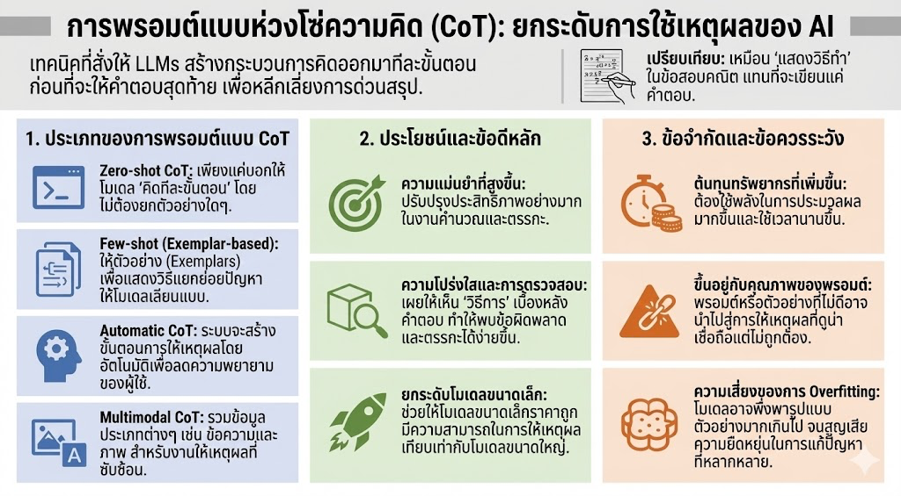

**Chain of Thought (CoT)** คือเทคนิคในงาน Prompt Engineering ที่ออกแบบมาเพื่อ**เพิ่มประสิทธิภาพการให้เหตุผล (Reasoning)** ของโมเดลภาษาขนาดใหญ่ (LLMs) โดยเฉพาะในงานที่ซับซ้อน แทนที่จะให้โมเดลตอบคำถามทันที เทคนิคนี้จะสั่งให้โมเดลแสดงขั้นตอนการคิดออกมาเป็นลำดับ (Step-by-step) ก่อนจะสรุปคำตอบสุดท้าย การทำเช่นนี้ช่วยลดข้อผิดพลาดที่เกิดจากการที่โมเดลพยายามตอบในทันทีโดยไม่ได้วางแผนการแก้ปัญหา

### ประเภทของ CoT Prompting
ในแหล่งข้อมูลมีการระบุรูปแบบการใช้งานหลักๆ ไว้ดังนี้:
*   **Zero-shot CoT:** เป็นการสั่งให้โมเดล "คิดทีละขั้นตอน" (เช่น ใช้คำสั่ง "explain your answer step-by-step") โดยที่ผู้ใช้ไม่จำเป็นต้องให้ตัวอย่างการคิดมาก่อน
*   **Few-shot (Exemplar-based):** การให้ตัวอย่าง (Exemplars) ที่แสดงวิธีการแยกย่อยปัญหาเป็นขั้นตอน เพื่อให้โมเดลเลียนแบบวิถีการให้เหตุผลนั้น
*   **Automatic CoT:** การที่ระบบสร้างขั้นตอนการให้เหตุผลขึ้นมาเองโดยอัตโนมัติ เพื่อลดภาระของผู้ใช้ในการเขียน Prompt
*   **Multimodal CoT:** การขยายขอบเขตการให้เหตุผลโดยใช้ข้อมูลหลายรูปแบบร่วมกัน เช่น **ข้อความและรูปภาพ** เพื่อแก้ปัญหาที่ซับซ้อนขึ้น

### ประโยชน์และข้อดี
*   **ความแม่นยำสูงขึ้น:** ช่วยให้โมเดลแก้ปัญหาทางคณิตศาสตร์ (Arithmetic reasoning) และการใช้เหตุผลเชิงตรรกะ (Logical reasoning) ได้ดีขึ้นอย่างมาก
*   **ความโปร่งใส (Transparency):** การแสดงขั้นตอนการคิดช่วยให้ผู้ใช้เข้าใจว่าโมเดลได้คำตอบมาได้อย่างไร ทำให้ง่ายต่อการตรวจสอบจุดบกพร่อง (Debugging)
*   **ยกระดับโมเดลขนาดเล็ก:** งานวิจัยพบว่า CoT สามารถทำให้โมเดลขนาดเล็กหรือราคาถูก มีความสามารถในการให้เหตุผลใกล้เคียงกับโมเดลขนาดใหญ่ที่ซับซ้อนกว่าได้

### ข้อจำกัดและสิ่งที่ควรระวัง
*   **ต้นทุนทรัพยากร:** การสร้างลำดับความคิดหลายขั้นตอนต้องใช้พลังงานในการประมวลผลมากขึ้นและใช้เวลานานขึ้น ซึ่งส่งผลต่อค่าใช้จ่าย
*   **คุณภาพของ Prompt:** ประสิทธิภาพของ CoT ขึ้นอยู่กับคุณภาพของคำสั่งและตัวอย่างที่ผู้ใช้ป้อน หาก Prompt ไม่ดีพอ อาจนำไปสู่เหตุผลที่ดูน่าเชื่อถือแต่ผิดพลาดได้ (Misleading reasoning)
*   **ความเสี่ยงในการ Overfitting:** โมเดลอาจจดจำรูปแบบการตอบจากตัวอย่างมากเกินไปจนทำให้ขาดความยืดหยุ่นในการแก้ปัญหาที่หลากหลาย

### การนำไปใช้งานจริง
CoT ถูกนำไปใช้อย่างกว้างขวางในหลายสาขา เช่น:
*   **การศึกษา:** ใช้สร้างคำอธิบายวิธีทำโจทย์คณิตศาสตร์หรือวิทยาศาสตร์แบบละเอียด
*   **การบริการลูกค้า:** ช่วยให้ Chatbot เข้าใจปัญหาที่ซับซ้อนและตอบคำถามได้ตรงจุดมากขึ้น
*   **งานวิจัย:** ช่วยให้นักวิจัยโครงสร้างลำดับความคิดในการแก้ปัญหาทางวิทยาศาสตร์
*   **จริยธรรมของ AI:** ช่วยอธิบายเหตุผลเบื้องหลังการตัดสินใจของ AI ในสถานการณ์ที่ต้องคำนึงถึงจริยธรรม

**การเปรียบเทียบ:**
เพื่อให้เห็นภาพชัดเจนขึ้น **Chain of Thought เปรียบเสมือนการที่นักเรียนแสดงวิธีทำในข้อสอบคณิตศาสตร์** แทนที่จะเขียนเพียงคำตอบสุดท้าย การแสดงวิธีทำช่วยให้แน่ใจว่าแต่ละขั้นตอนของการคำนวณถูกต้อง และหากคำตอบสุดท้ายผิด ครู (หรือผู้ใช้) ก็ยังสามารถย้อนกลับไปดูได้ว่าเริ่มผิดที่ขั้นตอนไหน

## ตัวอย่างการประยุกต์ใช้ CoT ในการวางกลยุทธ์พัฒนาผลิตภัณฑ์

### 1. การกำหนดคำสั่ง (Prompting) แบบทีละขั้นตอน
แทนที่จะถามว่า "เราควรพัฒนาแอปพลิเคชันจองที่พักอย่างไรให้ชนะคู่แข่ง?" เราควรใช้เทคนิค **Instruction-based CoT** โดยสั่งให้โมเดลแยกการคิดเป็นลำดับ:
*   **ขั้นตอนที่ 1:** วิเคราะห์ Pain Points ของผู้ใช้ในตลาดปัจจุบัน
*   **ขั้นตอนที่ 2:** เปรียบเทียบข้อดีและข้อเสีย (Pros and Cons) ของคู่แข่งหลักในตลาด
*   **ขั้นตอนที่ 3:** ระบุฟีเจอร์หลัก (MVP) ที่สามารถแก้ปัญหาได้ดีกว่าคู่แข่ง
*   **ขั้นตอนที่ 4:** วาง Roadmap การพัฒนาตามลำดับความสำคัญของผลกระทบต่อผู้ใช้

### 2. การใช้กระบวนการคิดเพื่อสร้างความโปร่งใส (Transparency)
การใช้ CoT ช่วยให้ทีมพัฒนาเข้าใจ **"ที่มา"** ของกลยุทธ์ ตัวอย่างเช่น หากโมเดลเสนอให้เน้นฟีเจอร์ AI Chatbot ในแอปฯ การใช้ CoT จะทำให้โมเดลแสดงเหตุผลรองรับ (Reasoning steps) เช่น:
*   "จากการวิเคราะห์ ข้อมูลระบุว่าผู้ใช้มักยกเลิกการจองหากไม่ได้รับคำตอบภายใน 5 นาที"
*   "ดังนั้น การเพิ่ม Chatbot จะช่วยลดอัตราการยกเลิก (Churn rate) และประหยัดต้นทุนบริการลูกค้า"
*   **ผลลัพธ์:** กลยุทธ์นี้จึงมีความสมเหตุสมผลเชิงตรรกะมากกว่าการเสนอเพียงชื่อฟีเจอร์

### 3. การประยุกต์ใช้ CoT หลากหลายรูปแบบ (Variants)
*   **Zero-shot CoT:** ผู้ใช้สามารถใช้ประโยคสั่งการสั้นๆ เช่น *"จงวางกลยุทธ์การขยายฐานผู้ใช้แอปฯ โดยคิดทีละขั้นตอนอย่างละเอียด"* เพื่อให้โมเดลใช้ความรู้ภายในตัวมันเองสร้างลำดับการคิดขึ้นมา
* **Few-shot (Exemplar-based):** ผู้ใช้ป้อนตัวอย่างกลยุทธ์ที่เคยประสบความสำเร็จในอดีต พร้อมแสดงวิธีคิดเบื้องหลัง เพื่อให้โมเดลเลียนแบบวิถีการให้เหตุผล (Reasoning pattern) สำหรับผลิตภัณฑ์ใหม่
*   **Multimodal CoT:** หากมีภาพร่างหน้าจอแอปฯ (UI Mockup) สามารถใช้ภาพร่วมกับข้อความเพื่อให้โมเดลวิเคราะห์และเสนอวิธีปรับปรุงกลยุทธ์ด้านประสบการณ์ผู้ใช้ (UX Strategy) จากข้อมูลภาพได้

### 4. ข้อดีต่อการพัฒนาผลิตภัณฑ์ดิจิทัล
*   **ลดข้อผิดพลาด:** ป้องกันการด่วนสรุปกลยุทธ์ที่อาจไม่ตอบโจทย์ตลาดจริง (Avoiding jumping to an answer)
*   **การแก้ไขปัญหาเชิงลึก (Multistep Reasoning):** ช่วยให้เห็นความเชื่อมโยงระหว่างเทคโนโลยี (Backend) และความต้องการทางธุรกิจ (Business Goal) ได้ชัดเจนขึ้น
*   **ความแม่นยำ:** การแตกปัญหาใหญ่ให้เป็นส่วนเล็กๆ (Manageable steps) ช่วยให้แผนงานมีความละเอียดและนำไปปฏิบัติได้จริง (Actionable) มากขึ้น

---

การใช้ CoT ในการวางกลยุทธ์ดิจิทัลเปรียบเสมือน **การประชุมทีมแบบ Whiteboarding** ที่เราไม่เพียงแต่พูดถึงเป้าหมายสุดท้าย แต่เราค่อยๆ ขีดเขียนลำดับเหตุการณ์ ตั้งแต่การเข้าใจลูกค้าไปจนถึงการเลือกเทคโนโลยี เพื่อให้ทุกคนเห็นภาพตรงกันว่าเหตุใดเราจึงเลือกเดินตามกลยุทธ์นั้น

**Chain of Thought (CoT) prompting** ไม่ได้เป็นเพียงเทคนิคการเขียนคำสั่งเพื่อหาคำตอบเท่านั้น แต่เป็นกลไกสำคัญในการ**ยกระดับศักยภาพการให้เหตุผล (Reasoning)** ของ AI ให้ใกล้เคียงกับกระบวนการคิดของมนุษย์มากขึ้น

1. **เปลี่ยน AI จาก "เครื่องตอบ" เป็น "ผู้ช่วยคิด":** หัวใจหลักของ CoT คือการเปลี่ยนจากการให้โมเดลกระโดดข้ามไปหาคำตอบที่ดูเหมือนจะถูกต้อง (jumping to an answer) มาเป็นการแสดงขั้นตอนการแก้ปัญหาที่โปร่งใสและเป็นลำดับ ซึ่งช่วยลดข้อผิดพลาดในการให้เหตุผลได้อย่างมีนัยสำคัญ

2. **สร้างความโปร่งใสและตรวจสอบได้ (Transparency & Observability):** การที่โมเดล "คิดดังๆ" ออกมาเป็นขั้นตอน ช่วยให้ผู้ใช้สามารถตรวจสอบจุดผิดพลาดและทำความเข้าใจตรรกะเบื้องหลังของ AI ได้ง่ายขึ้น ทำให้ AI ไม่ได้เป็นเพียง Black Box
3.  **ขยายขีดความสามารถโดยไม่จำกัดขนาดโมเดล:** CoT ช่วยให้โมเดลขนาดเล็กสามารถประมวลผลงานที่ซับซ้อน เช่น โจทย์คณิตศาสตร์ หรือการตัดสินใจเชิงจริยธรรม ได้ใกล้เคียงกับโมเดลขนาดใหญ่
4.  **ความท้าทายที่ต้องแลกมา:** แม้จะมีประโยชน์ อย่างไรก็ตามผู้ใช้ต้องแลกมาด้วย**ต้นทุนทรัพยากรที่สูงขึ้น** (Computational cost) และเวลาในการประมวลผลที่นานขึ้น รวมถึงความเสี่ยงในการสร้างเหตุผลที่ดูน่าเชื่อถือแต่ผิดพลาด (plausible yet incorrect) หากเขียนคำสั่งไม่รัดกุมพอ

ดังนั้นการใช้ CoT ในการทำงาน ไม่ว่าจะเป็นการวางกลยุทธ์ธุรกิจหรือการแก้ปัญหาเชิงเทคนิค เปรียบเสมือน **"การบังคับให้ AI แสดงวิธีทำในกระดาษทด"** ซึ่งไม่เพียงแต่จะช่วยให้ได้คำตอบที่แม่นยำขึ้นเท่านั้น แต่ยังช่วยให้เราในฐานะผู้ใช้งานได้เรียนรู้วิธีการวิเคราะห์ปัญหาอย่างเป็นระบบไปพร้อมๆ กับ AI อีกด้วย

## อ้างอิง
1. Microsoft Learn. (2025, May 29). Chain of Thought Prompting - .NET. เรียกดูจาก https://learn.microsoft.com,
    ◦ เนื้อหาหลัก: เน้นการใช้ Prompt Engineering เพื่อแสดงลำดับขั้นตอน (Steps) และผลลัพธ์ในแต่ละส่วนเพื่อลดความผิดพลาดของโมเดล,
2. Coursera Staff. (2025, April 18). Chain of Thought Prompting: Enhancing AI Reasoning and Decision-Making. เรียกดูจาก https://www.coursera.org,
    ◦ เนื้อหาหลัก: อธิบายประเภทของ CoT (Zero-shot, Automatic, Multimodal) และการนำไปใช้ในงานด้านเลขคณิตและเหตุผลทั่วไป (Arithmetic & Commonsense reasoning),,
3. Gadesha, V., Kavlakoglu, E., & Winland, V. (IBM Research). What is chain of thought (CoT) prompting? เรียกดูจาก https://www.ibm.com,
    ◦ เนื้อหาหลัก: ให้รายละเอียดเรื่องข้อดีด้านความโปร่งใส (Transparency) และข้อจำกัดเรื่องต้นทุนในการประมวลผล (High computational power)