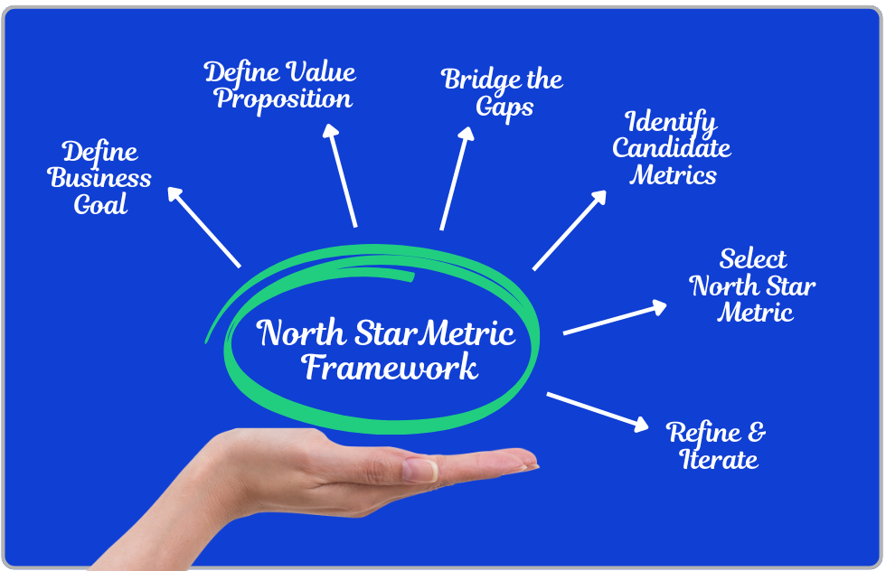

In an era of rapid technological flux, where AI increasingly permeates daily life and significantly impacts the business sector, organizational leaders frequently confront a complex set of challenges: "How do we drive the organization forward while sustaining profitability and growth?", "How do we keep pace with competitors?", "How do we maintain our competitive edge?", "How do we foster employee engagement, ownership, and skills, while simultaneously accelerating workflow?", and crucially, "What is our AI strategy?" to expedite the software development process. From the adage of yesteryear, "big fish eat small fish," to the subsequent era of "fast fish eat slow fish," today, speed alone suffices not. One must possess the direction to guide the organization forward with both speed and orientation—**Velocity**. For if an organization moves too slowly, or rapidly but in an erroneous direction, it invariably leads to business failure.

## 1. Speed vs. Velocity
Itamar Friedman, CEO of Qodo, offered a simple yet potent definition: "The difference between Velocity and Speed is that Velocity has a vector."

-   **Focusing solely on speed** makes the team appear perpetually busy, releasing new features frequently (High throughput), but these activities may not generate positive impact. Research titled *"Speed vs Direction: Why Moving Fast Isn’t Always Progress," Innovation and Strategy, Ibid.* indicates that nearly 70% of Digital Transformation projects fail because execution precedes strategy. For large enterprises or organizations in highly regulated industries, rushing to code as fast as possible without quality assurance can lead to costly errors *(AI-driven software development: Navigating the shift from speed to velocity, LinearB Blog)*.
-   **Velocity is progress with purpose.** For large organizations, Context Management and precision are essential. Thus, evolving from "vibe coding" to clear structural planning is paramount.

## 2. Defining via Vision and Strategy
To achieve Velocity, the team must first determine **"Where do we want to go?"** before asking, "We need to adopt AI; how do we execute this quickly?"

**Vision** is the long-term future image, akin to a North Star guiding the way. **Strategy** is the plan detailing how teams, systems, and processes will collaborate to realize that vision. Leaders must communicate this vision clearly to inspire and provide definite direction to the team *(10 Strategic Thinking Techniques Used by Global Leaders, KCT Academy Thailand)*.

A tool aiding direction definition is the **North Star Metric Framework (NSM)**, a key indicator reflecting the core value customers derive from the product. Having an NSM ensures all organizational parties (Product, Engineering, Marketing) work in alignment, focusing on the same outcome rather than working in silos *(The Ultimate Guide to the North Star Product Framework, GeeksforGeeks)*.

## 3. Focus on Outcome over Output
Building software is not about increasing throughput; it is about injecting value into that throughput (Deliver Value).

In a case study on teams focusing on impact from the article *Stop Obsessing Over Development Velocity, Focus on This Instead*, Itamar Gilad notes that in experiments, teams that reduced throughput but spent time on Product Discovery and focused on the Success ratio generated better business results than teams focusing on throughput by fourfold.

Jeff Patton, a product expert, stated, "Your job isn't to build more software. It's to build less software (Minimize output) so that you can maximize outcome and impact."

## 4. Techniques for Fast and Accurate Decision Making
Having direction does not imply slowing down. Research titled *Making Fast Strategic Decisions in High-Velocity Environments* by Kathleen M. Eisenhardt states that executive teams in the microcomputer industry found that teams deciding quickly and efficiently exhibit these behaviors:

-   **Use Real-time data:** They track operational metrics like daily bookings and cash flow closely, rather than relying solely on future forecasts.
-   **Consider Simultaneous Alternatives:** This helps visualize strengths and weaknesses comparatively and immediately reduces risk.
-   **Employ a conflict management process:** Fast teams use "Consensus with Qualification"—attempting to find consensus, but if unattainable, the leader makes a decisive call based on team input to avoid aimless waiting.

## 5. Balancing Tactical and Strategic Mindsets
Developers and team leaders must adapt their mindset appropriately.

-   **Tactical:** Focusing on the immediate task and solving immediate problems to complete the work.
-   **Strategic:** Focusing on the big picture, the future, and problem prevention.

Excessive tactical work leads to a "Crisis management loop" and burnout, while excessive strategic work can cause "Analysis Paralysis." Good leaders must maintain this balance *(The Strategic Vs. Tactical Mindset, DEV Community)*.

---

It is evident that software team development in the digital age is not a coding speed race, but a competition of who can **"learn and adjust direction"** towards creating customer value faster. Speed is merely an accelerator, but **Velocity (Speed+Direction)** is the true strategic asset. Successful organizations are those that cease running after currents, choosing instead to define clear goals and sprint towards them with agility.