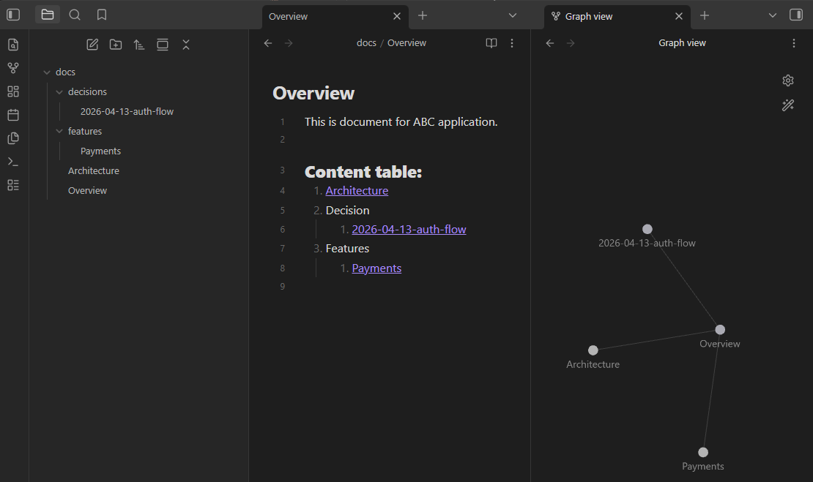

Software projects do not fail because code is invisible. They fail because context is invisible.

A repo may contain source code, but the reasoning behind the code often lives in chats, notebooks, screenshots, or someone’s memory. When that happens, new developers need time to rediscover the project, and AI agents get weak or incomplete context. Obsidian can solve that problem by turning project knowledge into a second brain that is easy to search, link, and maintain.

The second-brain approach works well when you keep important project notes inside the repository and write them in a format that both humans and AI can read. This is especially useful when you want the repo to store not only source code, but also documentation, important decisions, ideas, and development knowledge.

In most projects, markdown is already used for setup guides, README files, or change history. But if all project knowledge lives in disconnected markdown files, the documentation can still become messy. Obsidian helps by turning those markdown notes into a connected system.

## Why Obsidian Works Well

Obsidian is a system for creating linked documentation, which fits software development very well. It can also be extended into a knowledge management system or even a lightweight project management workspace through plugins such as Calendar and Timeline.

When you connect notes about architecture, product decisions, APIs, and bugs, you create a map of the project instead of a pile of isolated documents. A developer can open one note and jump to related decisions. An AI agent can do the same if the notes are stored in plain markdown inside the repo.

That turns the repository into an organized knowledge base, not just a place to store code.

## Example Folder Structure



Here is a practical structure that works well:

```text
docs/
    overview.md
    architecture.md
    decisions/
        2026-04-13-auth-flow.md
        2026-04-13-database-choice.md
    features/
        payments.md
        search.md
    meetings/
        2026-04-13-planning.md
```

Each note should answer one question well.

- `overview.md`: what the system is and who it is for.
- `architecture.md`: how the major parts fit together.
- `decisions/`: why a choice was made, including tradeoffs.
- `features/`: what each feature does and how it behaves.
- `meetings/`: what was discussed and what changed.

This pattern becomes best practice when the notes stay close to real work.

- Keep notes in markdown inside the repo or in a clearly structured docs folder.
- Keep each note focused on one topic, one decision, or one feature when the content has enough detail.
- If you update the source code, update the related note in the same pull request when possible.
- Link related notes so Obsidian can build a graph of the project knowledge.

Notes should stay concise with a TL;DR mindset. Link only what matters. For example, if a decision affects authentication, link that decision from the architecture note and from the related feature note. That is what makes the vault useful.

## How Notes Can Be Linked

This is where Obsidian becomes more powerful than a normal documents folder. Instead of storing notes as isolated files, you can connect them with wiki-style links.

For example:

```markdown
# architecture

The application uses a token-based login flow described in [[2026-04-13-auth-flow]].

Search is implemented as a separate module. See [[search]] for feature behavior.

The current database decision is documented in [[2026-04-13-database-choice]].
```

And inside a feature note:

```markdown
# search

Search supports product lookup, filtering, and ranking.

Related notes:
- [[architecture]]
- [[2026-04-13-database-choice]]
- [[2026-04-13-planning]]
```

With this approach, a human can jump from architecture to feature behavior to design decisions in seconds. An AI agent can also follow the same trail of linked markdown files and build a much better understanding of the repository.

## How Software developer Benefit

For Software developer, the value is speed and clarity.

A new developer can open the repo and quickly understand the product, the architecture, and the important tradeoffs. A senior engineer can review a decision without asking three people for context. A product owner can read the same notes and see why a feature exists.

This reduces repeated explanations. It also reduces the risk of changing something important just because the reason behind it was never written down.

The important habit is to contribute documentation regularly. Short, connected notes are much more useful than long documents that no one updates.

## How AI Agents Benefit

Today, developers increasingly work with AI agents, and agents perform much better when the context is structured.

If the repository contains clear markdown notes, an agent can:

- summarize the current architecture,
- explain why a feature exists,
- draft a new implementation plan,
- suggest changes that match previous decisions,
- and point out missing documentation.

That means the agent is not reading from source code alone. It is also reading the project’s memory, which can reduce wasted tokens and improve the quality of its output.

## The Best Rule

Write notes the same way you write code: be specific, keep them small, and update them when reality changes.

If a note is too long, split it. If a decision is obsolete, mark it clearly. If a feature changes, update the related note in the same pull request. That keeps the knowledge base trustworthy.

Obsidian becomes powerful when it is not treated as a personal diary, but as shared project memory.

## Conclusion

If your application repository is the body of the project, then Obsidian can be its memory.

That memory helps Software developer move faster, helps AI agents understand the codebase better, and helps the team keep a clear record of how decisions were made. The result is less friction, better collaboration, and a repo that is easier to read long after the original context has faded.

For modern software teams, that is the real value of a second brain.

You can try Obsidian here: https://obsidian.md/help/install

