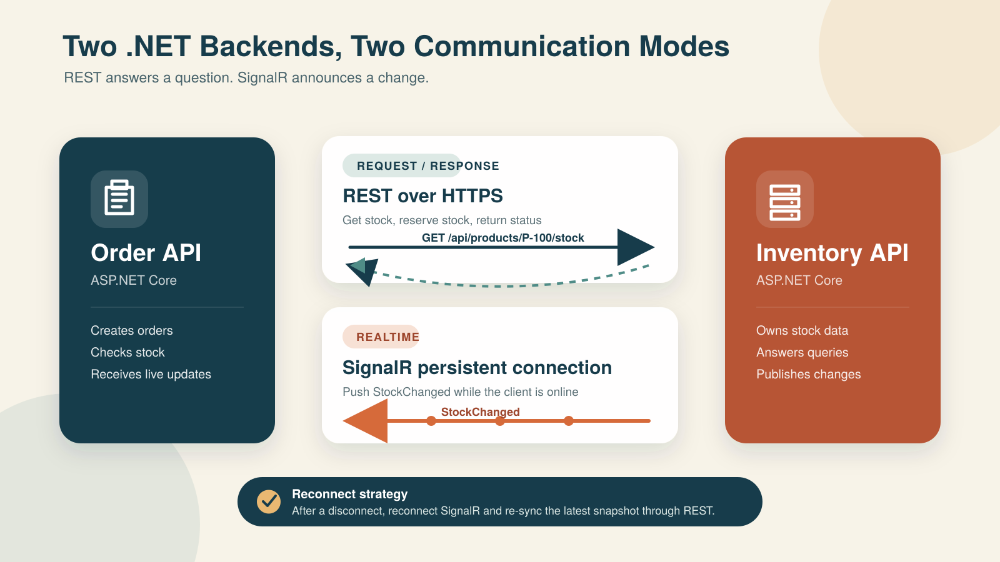

Once we split a system into more than one backend, the first question that comes up is: how do these systems talk to each other?

There are actually several protocols to choose from, including REST, gRPC, WebSocket, SignalR, and message brokers. But before deciding which one to use, we need to answer one more fundamental question: does this communication need an immediate response, and is the data allowed to be lost on the way?

In this article, I will use two systems to make the idea easier to see:

- **Order API** is responsible for creating and tracking orders
- **Inventory API** owns the product stock data

If the Order API needs to check whether there is enough stock, it sends a question to the Inventory API and waits for the answer. That is a **request-response** flow, and REST fits that kind of work very well.

But if the stock changes and we want the Inventory API to notify the Order API immediately, without polling every second, then we need **realtime** communication. This is where SignalR becomes useful.

So no, this is not a case of choosing REST or SignalR as if they were mutually exclusive. In real systems, we can use both together, letting each one do the job it is best at.

## Before Picking a Protocol, Look at the Communication Pattern

Communication between backends usually falls into a few main patterns:

| Pattern | Does the sender wait for a response? | Example | Common choices |
|---|---:|---|---|
| Request-response | Yes | Check stock, read customer data, calculate price | HTTP/REST, gRPC, GraphQL |
| Realtime push | No need to poll | Notify stock changed, progress, live status | SignalR, WebSocket, Server-Sent Events |
| Asynchronous messaging | No, and delivery matters | order created, payment completed | RabbitMQ, Azure Service Bus, Kafka |
| Streaming | Continuous flow of data | telemetry, log stream, market feed | gRPC streaming, Kafka, WebSocket |

One thing people often misunderstand is that **realtime** does not automatically mean **reliable**. SignalR can deliver data quickly to a connected client, but if the receiver is offline at that moment, the message is not automatically stored and replayed later.

So if every event must reach the other side at least once, it is worth considering a message broker such as RabbitMQ or Azure Service Bus. You can also combine a broker with SignalR, which we will come back to later.

## What Each Protocol Is Good For

### HTTP/REST

REST is probably the most familiar option for most developers. It is built on HTTP, usually carries JSON, and communicates through resources, URLs, HTTP methods, and status codes. For example:

```http
GET /api/products/P-100/stock
```

The advantages of REST are that it is easy to understand, easy to test with common tools, and generally has good logging and observability support. It also works cleanly across languages and platforms. The tradeoff is that JSON is larger than a binary protocol, and the contract is not as strict as gRPC unless we use OpenAPI or generate clients from a schema.

In most cases, REST is a good fit for public APIs, CRUD operations, data queries, and actions where the caller needs the result right away.

### gRPC

gRPC uses Protocol Buffers to define the contract and generally runs on HTTP/2. The payload is binary, which makes it smaller and faster than JSON in many cases. It also supports unary calls, client streaming, server streaming, and bidirectional streaming.

This is a good fit for internal service-to-service communication where we control both sides, want a type-safe contract, or expect high request volume. The tradeoff is that debugging is not as convenient as REST, because you cannot simply read the payload with your eyes, and browser connectivity is more limited.

### WebSocket

WebSocket keeps a two-way connection open, so both client and server can send data at any time. The per-message overhead is relatively low. That sounds great, but the tradeoff is that we need to design message format, routing, connection lifecycle, reconnect logic, and error handling ourselves.

WebSocket is therefore a good fit when we need a specialized protocol or very fine-grained control over the transport layer.

### SignalR

SignalR is an abstraction for realtime communication in ASP.NET Core. It uses a Hub as the message entry point. We can send data to a single connection, a user, a group, or all connections, and SignalR will choose the most suitable transport, such as WebSocket when the environment supports it.

The benefit is that it integrates well with dependency injection, authentication, authorization, and logging in ASP.NET Core. It also has client libraries for .NET, JavaScript, Java, and Swift. In our case, because both sides are .NET backends, the receiving side can use `Microsoft.AspNetCore.SignalR.Client` directly.

SignalR is great for push notifications and live data, but it is important to say again that SignalR is not a durable queue. Also, a Hub is short-lived, so we should not keep application state inside a Hub instance.

### Server-Sent Events, or SSE

SSE sends events from server to client in one direction over HTTP. It is good for progress updates, notifications, or feeds where the client does not need to send anything back over the same connection. For a simple one-way push scenario, SSE is interesting. But for a .NET system that needs two-way communication, SignalR is often more convenient.

### Message broker

RabbitMQ, Azure Service Bus, and Kafka do not replace REST in every case. They are useful when the sender should not depend on the receiver being available, or when we want the message to stay stored until it is successfully processed.

Think about a case where Inventory API must guarantee that Order API receives `StockChanged`, even when Order API is down. SignalR alone is not enough here. We should publish the event to a broker and let Order API consume it when it is ready again. SignalR can still be used to push the event to a dashboard or to any online connection at the same time.

## The Approach I Would Choose: REST for the Answer, SignalR for the Signal



From the diagram, I split the responsibilities of the two protocols like this:

1. Order API calls REST to read stock or reserve inventory, and waits for a clear result
2. Order API keeps a SignalR connection open to receive `StockChanged` immediately
3. If SignalR disconnects, the client reconnects automatically
4. After reconnecting, Order API queries the latest snapshot through REST again, because events that happened while disconnected may be missed

The short version is: **events tell us that something changed, but REST asks for the latest state we can trust**

## Building the Inventory API

For this example, I will use Minimal API so we can focus on the important parts without too much ceremony.

Start by creating the model and the strongly typed Hub contract:

```csharp
using Microsoft.AspNetCore.SignalR;

public sealed record StockResponse(
    string ProductId,
    int AvailableQuantity,
    DateTimeOffset UpdatedAt);

public sealed record UpdateStockRequest(int AvailableQuantity);

public sealed record StockChanged(
    string ProductId,
    int AvailableQuantity,
    DateTimeOffset OccurredAt);

public interface IInventoryClient
{
    Task StockChanged(StockChanged message);
}

public sealed class InventoryHub : Hub<IInventoryClient>
{
}
```

I chose a strongly typed Hub because it lets us verify method names and data types at compile time instead of spreading magic strings around the codebase. If we mistype something, we find out before running the app.

Next, create the REST endpoint and expose the SignalR Hub:

```csharp
using System.Collections.Concurrent;
using Microsoft.AspNetCore.SignalR;

var builder = WebApplication.CreateBuilder(args);

builder.Services.AddSignalR();

var app = builder.Build();
var stocks = new ConcurrentDictionary<string, StockResponse>();

app.MapGet("/api/products/{productId}/stock", (
    string productId) =>
{
    return stocks.TryGetValue(productId, out var stock)
        ? Results.Ok(stock)
        : Results.NotFound();
});

app.MapPut("/api/products/{productId}/stock", async (
    string productId,
    UpdateStockRequest request,
    IHubContext<InventoryHub, IInventoryClient> hub,
    CancellationToken cancellationToken) =>
{
    if (request.AvailableQuantity < 0)
    {
        return Results.ValidationProblem(new Dictionary<string, string[]>
        {
            ["availableQuantity"] = ["Quantity must be zero or greater."]
        });
    }

    var now = DateTimeOffset.UtcNow;
    var stock = new StockResponse(
        productId,
        request.AvailableQuantity,
        now);

    stocks[productId] = stock;

    await hub.Clients.All.StockChanged(
        new StockChanged(productId, stock.AvailableQuantity, now));

    return Results.Ok(stock);
});

app.MapHub<InventoryHub>("/hubs/inventory");

app.Run();
```

One thing worth noticing is that the code does not create `InventoryHub` manually. Instead, it uses `IHubContext` to send events from an endpoint or an application service, because a Hub is a transient object and should not be used to store state.

To keep the example short, I store data in memory here. In a real system, we should persist to the database first and then publish the event. We also need to think about the dual-write problem. For example, the database commit may succeed, but the process may crash before the event is sent. In that case, the consumer never sees the change. If the event matters, we should use a **Transactional Outbox** together with a message broker.

## Let the Order API Read Data Through REST

On the Order API side, we will call REST to the Inventory API. One thing to watch out for is that we should not create a new `HttpClient` for every request, because that can lead to socket or port exhaustion and poor DNS handling. In applications that use dependency injection, we can use `IHttpClientFactory` or a typed client.

Start by creating a client that hides HTTP details inside a single class:

```csharp
using System.Net;
using System.Net.Http.Json;

public sealed class InventoryClient(HttpClient httpClient)
{
    public async Task<StockResponse?> GetStockAsync(
        string productId,
        CancellationToken cancellationToken)
    {
        using var response = await httpClient.GetAsync(
            $"/api/products/{Uri.EscapeDataString(productId)}/stock",
            cancellationToken);

        if (response.StatusCode is HttpStatusCode.NotFound)
        {
            return null;
        }

        response.EnsureSuccessStatusCode();

        return await response.Content.ReadFromJsonAsync<StockResponse>(
            cancellationToken);
    }
}
```

Then register the typed client in `Program.cs`:

```csharp
var builder = WebApplication.CreateBuilder(args);

builder.Services.AddHttpClient<InventoryClient>(httpClient =>
{
    httpClient.BaseAddress = new Uri(
        builder.Configuration["Services:InventoryApi"]
        ?? throw new InvalidOperationException(
            "Services:InventoryApi is not configured."));

    httpClient.Timeout = TimeSpan.FromSeconds(3);
});
```

Then use it from an endpoint:

```csharp
app.MapPost("/api/orders", async (
    CreateOrderRequest request,
    InventoryClient inventory,
    CancellationToken cancellationToken) =>
{
    var stock = await inventory.GetStockAsync(
        request.ProductId,
        cancellationToken);

    if (stock is null ||
        stock.AvailableQuantity < request.Quantity)
    {
        return Results.Conflict(new
        {
            code = "INSUFFICIENT_STOCK",
            message = "Insufficient stock"
        });
    }

    // Create the order and reserve stock here.
    return Results.Accepted();
});
```

When we move this to production, we should add resilience handlers to deal with transient failures. But do not add retries to everything blindly, because different operations have different consequences:

- Retry `GET` requests when appropriate, because they are usually idempotent
- Do not auto-retry `POST` requests that create data unless you also have an idempotency key
- Always set a timeout so requests do not hang and consume threads or connections forever
- Separate business errors such as stock shortage from technical errors such as timeout or service unavailable
- Pass the cancellation token from the incoming request to the outgoing request

## Adding Realtime with SignalR

Next, we will let the Order API receive realtime events. Start by installing the client package:

```bash
dotnet add package Microsoft.AspNetCore.SignalR.Client
```

Then create a `BackgroundService` to manage the connection:

```csharp
using Microsoft.AspNetCore.SignalR.Client;

public sealed class InventoryRealtimeWorker(
    IConfiguration configuration,
    InventorySnapshotStore snapshotStore,
    ILogger<InventoryRealtimeWorker> logger)
    : BackgroundService
{
    private HubConnection? _connection;

    protected override async Task ExecuteAsync(
        CancellationToken stoppingToken)
    {
        var inventoryUrl =
            configuration["Services:InventoryApi"]
            ?? throw new InvalidOperationException(
                "Services:InventoryApi is not configured.");

        _connection = new HubConnectionBuilder()
            .WithUrl($"{inventoryUrl.TrimEnd('/')}/hubs/inventory")
            .WithAutomaticReconnect()
            .Build();

        _connection.On<StockChanged>(
            nameof(IInventoryClient.StockChanged),
            message =>
            {
                snapshotStore.Upsert(message);
                logger.LogInformation(
                    "Stock {ProductId} changed to {Quantity}",
                    message.ProductId,
                    message.AvailableQuantity);
            });

        _connection.Reconnected += async connectionId =>
        {
            logger.LogInformation(
                "SignalR reconnected with connection {ConnectionId}",
                connectionId);

            // Re-sync current state through REST here. Events that happened
            // while disconnected aren't guaranteed to be replayed.
            await snapshotStore.MarkForRefreshAsync(stoppingToken);
        };

        await StartWithRetryAsync(_connection, stoppingToken);
        await Task.Delay(Timeout.Infinite, stoppingToken);
    }

    private static async Task StartWithRetryAsync(
        HubConnection connection,
        CancellationToken cancellationToken)
    {
        while (!cancellationToken.IsCancellationRequested)
        {
            try
            {
                await connection.StartAsync(cancellationToken);
                return;
            }
            catch when (!cancellationToken.IsCancellationRequested)
            {
                await Task.Delay(TimeSpan.FromSeconds(5), cancellationToken);
            }
        }
    }

    public override async Task StopAsync(
        CancellationToken cancellationToken)
    {
        if (_connection is not null)
        {
            await _connection.DisposeAsync();
        }

        await base.StopAsync(cancellationToken);
    }
}
```

Finally, register the worker and the store:

```csharp
builder.Services.AddSingleton<InventorySnapshotStore>();
builder.Services.AddHostedService<InventoryRealtimeWorker>();
```

`WithAutomaticReconnect()` helps when the connection was already established once and then dropped, but we still need to handle the very first connection attempt ourselves. That is why `StartWithRetryAsync` exists in the example.

The in-memory snapshot is useful for displaying data or reducing the number of queries, but it should not be treated as the final source of truth for critical decisions such as actually reserving stock. Before we commit a transaction, we should always confirm the state with Inventory API again.

## Do Not Forget Security

Even if the two backends live inside a private network, that does not mean every request should be trusted automatically. At a minimum, the system should have:

- HTTPS to encrypt data in transit
- OAuth 2.0 Client Credentials, workload identity, or mTLS to authenticate services
- Authorization policies that limit which service can call which endpoint or Hub
- Secret and certificate rotation without hardcoding values into source code
- Rate limiting and payload validation to protect the system from abnormal traffic

For SignalR, the .NET client can send an access token through `AccessTokenProvider`:

```csharp
var connection = new HubConnectionBuilder()
    .WithUrl(hubUrl, options =>
    {
        options.AccessTokenProvider = tokenProvider.GetAccessTokenAsync;
    })
    .WithAutomaticReconnect()
    .Build();
```

Both the Hub and the REST endpoint should use matching authorization policies, but the scopes should still be separated by responsibility, such as `inventory.read`, `inventory.write`, and `inventory.subscribe`, so no service gets more access than it really needs.

## What Else Should We Think About Before Production?

### Contract and versioning

Two backends are not always deployed at the same time, so the contract should stay backward compatible:

- Add new fields as optional
- Do not change the meaning of existing fields
- Version REST endpoints when there is a breaking change
- Version event names or payloads when old consumers are still running
- Use OpenAPI or a shared contract package carefully, so the package does not become a coupling point that forces every service to deploy together

### Observability

When something breaks, we should be able to trace which request or event passed through which service:

- Send a correlation ID or use W3C Trace Context
- Track latency, error rate, retry count, and reconnect count
- Log business identifiers such as `OrderId` and `ProductId`, but do not log tokens or unnecessary personal data
- Alert based on user impact, not only CPU usage

### Scale-out

When Inventory API runs multiple instances, each SignalR connection is attached to a different machine. Sending `Clients.All` from one instance therefore requires a scale-out solution such as a Redis backplane or a managed SignalR service, so the message can reach connections on other instances too.

REST, on the other hand, should sit behind a load balancer and should not depend on the in-memory state of any single instance.

### Failure and consistency

Once the system is split apart, there is no single transaction covering both databases anymore. That means we need to be explicit about the behavior:

- If Inventory API times out, should Order API reject, retry, or accept the order for later verification?
- If stock reservation succeeds but order creation fails, how do we compensate?
- How should duplicate events be handled idempotently?
- How stale can the data be and still be acceptable?
- If SignalR stays disconnected for too long, when do we decide that the snapshot is no longer usable?

These questions may look like a lot, but the answers affect correctness much more than the choice of transport itself.

## Which Option Fits Which Situation?

| Need | First option to consider |
|---|---|
| CRUD or query that must respond immediately | REST |
| High-volume internal call with a strict contract | gRPC |
| Push live data to a .NET backend or an online UI | SignalR |
| One-way push over plain HTTP | SSE |
| Every message must be stored and delivered even if the consumer is offline | Message broker |
| High-volume event stream with replay capability | Kafka or a streaming platform |

For the Order API and Inventory API example, I would choose this:

- Use **REST** for `GetStock`, `ReserveStock`, and any operation where we need a clear success or failure result
- Use **SignalR** for `StockChanged` so online consumers can update immediately
- After reconnecting, **sync through REST**
- If `StockChanged` must never be lost, add a **message broker and Outbox**, rather than trying to turn SignalR into a queue

## My Personal Take

Choosing a protocol should not start with the question of which one is fastest or which one is trending. It should start with what our data actually needs.

If the operation needs a clear success or failure result right away, REST is usually a simple and sufficient starting point for most systems. SignalR is better when we want to signal that something changed so online systems can react immediately.

The important part is to separate **answers we must trust** from **signals we must deliver quickly**. Once the responsibilities are clear, the system becomes easier to understand, easier to test, and easier to scale without locking everything into one technology. We do not need to begin with a more complex architecture than the problem really requires.

## Further Reading

- [Make HTTP requests using IHttpClientFactory in ASP.NET Core](https://learn.microsoft.com/aspnet/core/fundamentals/http-requests)
- [HttpClient guidelines for .NET](https://learn.microsoft.com/dotnet/fundamentals/networking/http/httpclient-guidelines)
- [Overview of ASP.NET Core SignalR](https://learn.microsoft.com/aspnet/core/signalr/introduction)
- [Use hubs in ASP.NET Core SignalR](https://learn.microsoft.com/aspnet/core/signalr/hubs)
- [ASP.NET Core SignalR .NET client](https://learn.microsoft.com/aspnet/core/signalr/dotnet-client)
