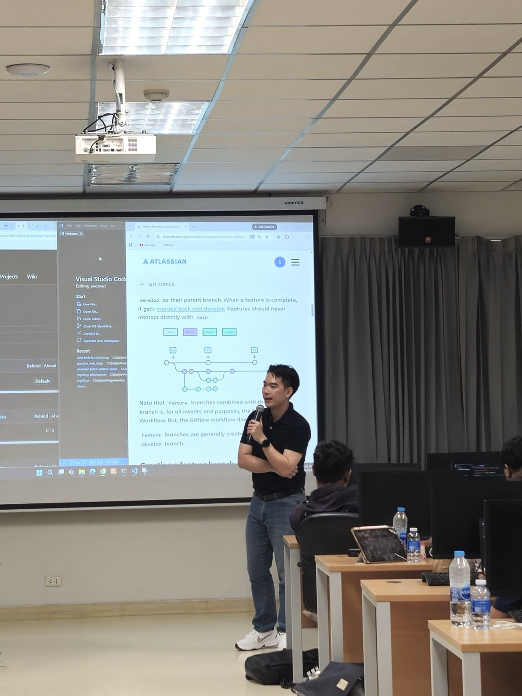
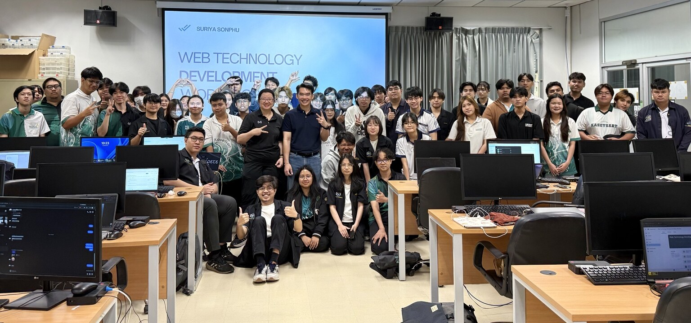

On 12–13 September 2026, I had the opportunity to return to **Kasetsart University, Sriracha Campus**. This time I was not there as a student, but as an instructor for the **Web Technology Development Basic Workshop** for more than 50 third-year students in Digital Science and Technology, Faculty of Science at Sriracha, as part of their preparation for Cooperative Education.

For me, the workshop meant more than teaching a set of technologies. It was a chance to share what I have learned from real software-development work: software is not only about making code run. It is also about how we think, design, collaborate, make decisions, and take responsibility for what we deliver.

<!--more-->

## More Than Learning a Framework

The goal of this workshop was not simply to make the students capable of building a backend or frontend that works. I wanted them to understand **how a software system is actually built** — from the idea and application structure to the way a real development team collaborates.

Frameworks and tools keep changing. Today we may work with .NET, Vue.js, or TypeScript. A few years from now, some of those tools may be different. The engineering foundations, however, remain transferable.

That is why I wanted the students to see Full-stack Development as more than connecting a frontend to a backend. It means understanding the relationship between the parts of a system: APIs, data flow, application structure, state management, and the design decisions behind the code.

## From Zero to Full Stack

The workshop was designed as a hands-on journey. We started with the fundamentals of a web application, then gradually moved into backend development, frontend development, and finally the integration between both sides.

The core topics included RESTful APIs, backend development, frontend development, TypeScript, data handling, and full-stack application integration. More importantly, I tried to explain what each part is responsible for and why we structure software in a particular way.

One principle I repeated throughout the workshop was: **do not rush to memorize syntax; understand the reason behind the code first.**

When we understand the structure, learning another framework becomes easier. More importantly, we are better prepared to solve problems that do not have a ready-made tutorial.

During the lab, I was happy to see the questions gradually change from “what should I type next?” to “why do we do it this way?” That shift matters. Software development is not built on remembering commands; it is built on understanding the problem and making reasoned decisions.

## Software Development Is a Team Sport

Another important part of the workshop was how software-development teams work together.

In professional work, code does not end on the developer's machine. It must be reviewed, changed, released, maintained, and often handed over to other people in the future.

The students therefore practiced the ideas behind **Gitflow Workflow**, Feature Branches, Pull Requests, and collaborative development practices that help reduce risk when many people work on the same codebase.

We also discussed Agile principles and practical best practices that help teams deliver continuously without treating software quality as an afterthought.

I wanted them to see that “the code works” is only one condition of good software. In real projects, code also needs to be **readable, reviewable, changeable, testable, and maintainable by someone else**.

## Strong Foundations Before AI

Today, AI Agents can help developers write code, implement features, and complete multi-step development tasks remarkably quickly.

But I believe that getting the most value from AI does not begin with becoming the best at prompting. It begins with **understanding what we are building** and being able to judge whether what AI generates is actually appropriate for our system.

Without an understanding of architecture, data flow, security, maintainability, and software-development principles, it is very easy to generate code quickly while also creating unnecessary **Technical Debt**.

The development path I wanted the students to see is closer to this:

**Understand → Design → Build → Collaborate → Improve → Accelerate with AI**

rather than:

**Prompt → Generate → Copy → Hope it works**

AI should amplify a developer's capability, not remove the need to think.

With strong foundations, AI Agents can then become genuinely useful for feature implementation, refactoring, testing, documentation, and code review — while the developer still has the knowledge required to evaluate the result.

## What I Wanted the Students to Take Away

The workshop time was limited, and I could not deliver every topic I had prepared.

Instead of rushing through every slide, I chose to focus on the quality of understanding. I wanted the students to think, experiment, ask questions, and understand what they were building.

Software development is not a skill that can be completed in two days. The important part starts after the workshop: continued practice, building real things, making mistakes, and learning again.

What impressed me most was the students' interest, participation, and productivity throughout the workshop. Many of them started from the fundamentals and gradually connected the pieces until they could see the shape of a real Full-stack Application.

Returning to the university was therefore not only an opportunity to share knowledge. It also gave me new energy. It reminded me why I enjoy software development and why sharing engineering knowledge with the next generation matters.

The main message I wanted to leave with them is simple: **tools will change, but strong foundations will keep taking us forward.**

## Workshop Materials

The teaching materials and hands-on labs used in this workshop are available as a dedicated workshop site:

**[Web Technology Development Basic Workshop](https://suriyasonp.github.io/web-tech-ku-workshop/)**

The site brings together the backend, frontend, Git workflow, and hands-on learning materials used during the workshop in a format that is easier to follow than browsing the repository directly.
