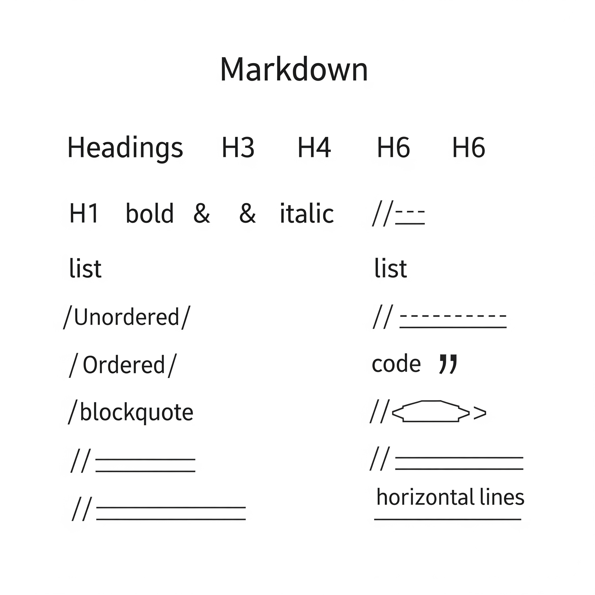

This guide demonstrates the Markdown syntax you can use in Hugo blog posts. Each section includes both the Markdown code and its rendered output.

<!--more-->

## Basic Syntax

### Headers

In Markdown, you create headers using the `#` symbol. The number of `#` determines the header level:

```markdown
# Header 1
## Header 2
### Header 3
#### Header 4
##### Header 5
###### Header 6
```

### Text Formatting

Here's how to format text in different ways:

```markdown
**Bold text** or __bold text__
*Italic text* or _italic text_
***Bold and italic text***
~~Strikethrough text~~
```

Renders as:

**Bold text** or __bold text__
*Italic text* or _italic text_
***Bold and italic text***
~~Strikethrough text~~

### Links

There are several ways to create links:

```markdown
[Basic link to Google](https://www.google.com)
[Link with title](https://www.google.com "Google's Homepage")
[Reference link][reference-id]

[reference-id]: https://www.google.com
```

### Images

Images are similar to links but start with an exclamation mark:

```markdown

```

### Lists

#### Unordered Lists
```markdown
* First item
* Second item
  * Nested item
  * Another nested item
* Third item
```

Renders as:
* First item
* Second item
  * Nested item
  * Another nested item
* Third item

#### Ordered Lists
```markdown
1. First step
2. Second step
   1. Sub-step A
   2. Sub-step B
3. Third step
```

Renders as:
1. First step
2. Second step
   1. Sub-step A
   2. Sub-step B
3. Third step

### Code

#### Inline Code
Use backticks for `inline code`.

#### Code Blocks
For multiple lines of code, use triple backticks with optional language specification:

```python
def hello_world():
    print("Hello, World!")
```

```javascript
function sayHello() {
    console.log("Hello, World!");
}
```

### Tables

Create tables using pipes and hyphens:

```markdown
| Header 1 | Header 2 | Header 3 |
|----------|----------|----------|
| Cell 1   | Cell 2   | Cell 3   |
| Cell 4   | Cell 5   | Cell 6   |
```

Renders as:

| Header 1 | Header 2 | Header 3 |
|----------|----------|----------|
| Cell 1   | Cell 2   | Cell 3   |
| Cell 4   | Cell 5   | Cell 6   |

### Blockquotes

For quotes and citations:

```markdown
> This is a blockquote
> It can span multiple lines
>
> > And can be nested
```

Renders as:
> This is a blockquote
> It can span multiple lines
>
> > And can be nested

### Task Lists

Create checkable task lists:

```markdown
- [x] Completed task
- [ ] Incomplete task
- [x] Another completed task
```

Renders as:
- [x] Completed task
- [ ] Incomplete task
- [x] Another completed task

## Advanced Features

### Footnotes

Add footnotes to your text[^1].

[^1]: This is a footnote.

### Definition Lists

```markdown
Term
: Definition for the term
: Another definition for the term

Another Term
: Definition of another term
```

### Emoji

Many Markdown processors support emoji shortcodes:
:smile: :heart: :thumbsup:

## Tips for Blog Writing

1. Use headers to organize your content
2. Include code blocks with syntax highlighting when sharing code
3. Use lists to break down complex information
4. Add images to make your posts more engaging
5. Use blockquotes to highlight important information
6. Include links to reference materials

## Conclusion

This guide covers the most commonly used Markdown syntax for blog writing. For more detailed information, visit the [official Markdown guide](https://www.markdownguide.org/).