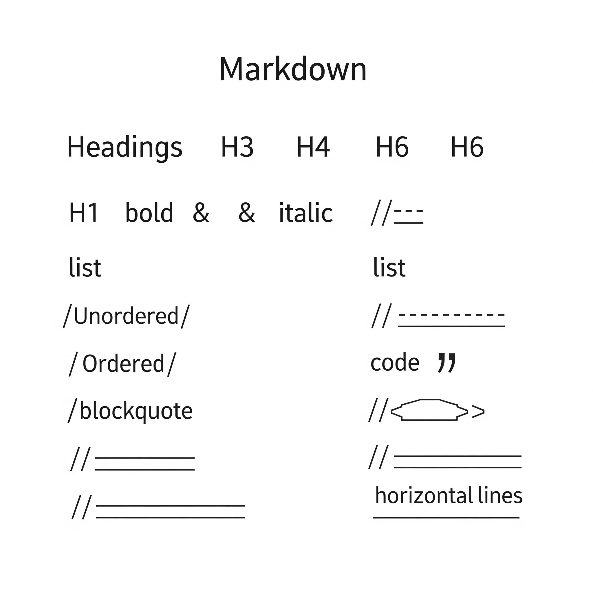

คู่มือนี้จะแสดงวิธีการใช้งาน Markdown สำหรับการเขียนบล็อกใน Hugo โดยแต่ละส่วนจะมีทั้งโค้ด Markdown และตัวอย่างผลลัพธ์ที่ได้

<!--more-->

## ไวยากรณ์พื้นฐาน

### หัวข้อ

ใน Markdown เราสร้างหัวข้อโดยใช้สัญลักษณ์ `#` จำนวนของ `#` จะกำหนดระดับของหัวข้อ:

```markdown
# หัวข้อระดับ 1
## หัวข้อระดับ 2
### หัวข้อระดับ 3
#### หัวข้อระดับ 4
##### หัวข้อระดับ 5
###### หัวข้อระดับ 6
```

### การจัดรูปแบบข้อความ

วิธีการจัดรูปแบบข้อความแบบต่างๆ:

```markdown
**ตัวหนา** หรือ __ตัวหนา__
*ตัวเอียง* หรือ _ตัวเอียง_
***ตัวหนาและเอียง***
~~ขีดฆ่า~~
```

ผลลัพธ์ที่ได้:

**ตัวหนา** หรือ __ตัวหนา__
*ตัวเอียง* หรือ _ตัวเอียง_
***ตัวหนาและเอียง***
~~ขีดฆ่า~~

### การสร้างลิงก์

มีหลายวิธีในการสร้างลิงก์:

```markdown
[ลิงก์พื้นฐานไปยัง Google](https://www.google.com)
[ลิงก์พร้อมคำอธิบาย](https://www.google.com "หน้าแรกของ Google")
[ลิงก์แบบอ้างอิง][reference-id]

[reference-id]: https://www.google.com
```

### การแทรกรูปภาพ

การแทรกรูปภาพคล้ายกับการสร้างลิงก์ แต่เพิ่มเครื่องหมายอัศเจรีย์ไว้ด้านหน้า:

```markdown

```

### รายการ

#### รายการแบบไม่เรียงลำดับ
```markdown
* รายการที่ 1
* รายการที่ 2
  * รายการย่อย
  * รายการย่อยอีกอัน
* รายการที่ 3
```

ผลลัพธ์ที่ได้:
* รายการที่ 1
* รายการที่ 2
  * รายการย่อย
  * รายการย่อยอีกอัน
* รายการที่ 3

#### รายการแบบเรียงลำดับ
```markdown
1. ขั้นตอนที่ 1
2. ขั้นตอนที่ 2
   1. ขั้นตอนย่อย ก
   2. ขั้นตอนย่อย ข
3. ขั้นตอนที่ 3
```

ผลลัพธ์ที่ได้:
1. ขั้นตอนที่ 1
2. ขั้นตอนที่ 2
   1. ขั้นตอนย่อย ก
   2. ขั้นตอนย่อย ข
3. ขั้นตอนที่ 3

### โค้ด

#### โค้ดแบบบรรทัดเดียว
ใช้เครื่องหมาย backtick สำหรับ `โค้ดในบรรทัด`

#### โค้ดแบบหลายบรรทัด
สำหรับโค้ดหลายบรรทัด ใช้เครื่องหมาย backtick สามตัวพร้อมระบุภาษา:

```python
def สวัสดี():
    print("สวัสดีชาวโลก!")
```

```javascript
function สวัสดี() {
    console.log("สวัสดีชาวโลก!");
}
```

### ตาราง

สร้างตารางโดยใช้เครื่องหมาย pipe และขีด:

```markdown
| หัวข้อ 1 | หัวข้อ 2 | หัวข้อ 3 |
|----------|----------|----------|
| เซลล์ 1  | เซลล์ 2  | เซลล์ 3  |
| เซลล์ 4  | เซลล์ 5  | เซลล์ 6  |
```

ผลลัพธ์ที่ได้:

| หัวข้อ 1 | หัวข้อ 2 | หัวข้อ 3 |
|----------|----------|----------|
| เซลล์ 1  | เซลล์ 2  | เซลล์ 3  |
| เซลล์ 4  | เซลล์ 5  | เซลล์ 6  |

### ข้อความอ้างอิง

สำหรับการอ้างอิงข้อความ:

```markdown
> นี่คือข้อความอ้างอิง
> สามารถมีหลายบรรทัดได้
>
> > และสามารถซ้อนกันได้
```

ผลลัพธ์ที่ได้:
> นี่คือข้อความอ้างอิง
> สามารถมีหลายบรรทัดได้
>
> > และสามารถซ้อนกันได้

### รายการตรวจสอบ

สร้างรายการที่มีช่องติ๊ก:

```markdown
- [x] งานที่เสร็จแล้ว
- [ ] งานที่ยังไม่เสร็จ
- [x] งานที่เสร็จแล้วอีกอัน
```

ผลลัพธ์ที่ได้:
- [x] งานที่เสร็จแล้ว
- [ ] งานที่ยังไม่เสร็จ
- [x] งานที่เสร็จแล้วอีกอัน

## คุณสมบัติขั้นสูง

### เชิงอรรถ

เพิ่มเชิงอรรถในเนื้อหา[^1]

[^1]: นี่คือเชิงอรรถ

### รายการคำจำกัดความ

```markdown
คำศัพท์
: ความหมายของคำศัพท์
: ความหมายอื่นของคำศัพท์

คำศัพท์อื่น
: ความหมายของคำศัพท์อื่น
```

### อิโมจิ

Markdown หลายตัวรองรับการใช้อิโมจิ:
:smile: :heart: :thumbsup:

## เทคนิคการเขียนบล็อก

1. ใช้หัวข้อในการจัดระเบียบเนื้อหา
2. แทรกโค้ดพร้อมการระบายสีไวยากรณ์เมื่อแบ่งปันโค้ด
3. ใช้รายการในการแบ่งข้อมูลที่ซับซ้อน
4. เพิ่มรูปภาพเพื่อให้โพสต์น่าสนใจมากขึ้น
5. ใช้ข้อความอ้างอิงเพื่อเน้นข้อมูลสำคัญ
6. แทรกลิงก์ไปยังแหล่งข้อมูลอ้างอิง

## สรุป

คู่มือนี้ครอบคลุมไวยากรณ์ Markdown ที่ใช้บ่อยสำหรับการเขียนบล็อก สำหรับข้อมูลเพิ่มเติม สามารถเยี่ยมชม [คู่มือ Markdown อย่างเป็นทางการ](https://www.markdownguide.org/)